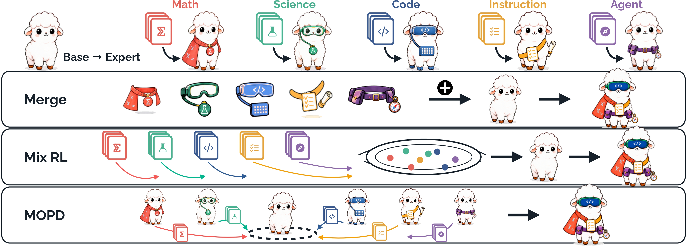

<div align="left">
  
</div>

<h1 align="center">Consolidating RLVR Capabilities Across Domains:<br>A Deep Dive into Fusion Paradigms</h1>

<div align="center">

[](https://arxiv.org/)
[](https://huggingface.co/collections/Siye01/llm-fusion)

</div>


In this work, we organise the three ways of consolidating RLVR-trained domain experts by the artefacts each reuses — **Merge** (task vectors), **Mix RL** (datasets) and **MOPD** (both) — and compare them across model scales with shared experts, data and benchmarks.

<div align="center">
  
</div>

## Highlights

- **A controlled comparison of Merge, Mix RL and MOPD**, with shared experts, data and benchmarks.
- **Why they diverge by domain**: cross-domain relations in behaviour and in task-vector geometry.
- **What fusion does not buy**: no broader solution coverage, no held-out capability loss.
- **How to choose**: costs and prerequisites span an order of magnitude.


## Setup


**1. Install.** This project is built on top of [verl](https://github.com/verl-project/verl). Follow the [official installation guide](https://verl.readthedocs.io/en/latest/start/install.html#install-from-custom-environment) for the backend you intend to use — the released runs used FSDP for training and vLLM for rollout — then install this fork:

```bash
pip install -e .
```

The IF verifier needs the NLTK corpora present locally, and the math verifier needs its ANTLR parser extra:

```bash
# IF domain (IFEvalG + IFBench)
pip install nltk langdetect immutabledict emoji syllapy
python -c "import nltk; [nltk.download(p) for p in ['punkt','punkt_tab','stopwords','averaged_perceptron_tagger_eng']]"

# Math domain
pip install 'math-verify[antlr4_9_3]'
```

**2. Download the data.** This fetches the training and test sets from the Hub.

```bash
python examples/llm_fusion/download_data.py --output-dir /path/to/data
```


**3. Start a code sandbox.** The Code domain and both LiveCodeBench benchmarks score rollouts by executing unit tests in [SandboxFusion](https://github.com/bytedance/SandboxFusion), which runs as a separate service:

```bash
sudo yum install -y docker || sudo dnf install -y docker
podman run -it -p 8080:8080 \
    vemlp-cn-beijing.cr.volces.com/preset-images/code-sandbox:server-20250609
```

`SANDBOX_FUSION_URL` already defaults to `http://localhost:8080/run_code`, which matches the port published above.


**4. Fill in the paths.** Edit `examples/llm_fusion/paths.sh`, or export the four roots:

```bash
export MODEL_PATH=/path/to/Qwen3-4B-Instruct-2507
export TRAIN_DATA_ROOT=/path/to/data/train
export EVAL_DATA_ROOT=/path/to/data/test
export OUTPUT_ROOT=/path/to/outputs            # checkpoints and dumps
```

## Training

All three scripts are launched the same way. For multi-node runs, start the Ray cluster first and run the script on the head node.

```bash
# one per-domain expert (Math shown; see the script header for the other four)
bash examples/llm_fusion/train/train_expert_math.sh

# mixed-domain GRPO: one policy on all five domains
bash examples/llm_fusion/train/train_mix_rl.sh

# multi-teacher on-policy distillation from the five experts
TEACHER_ROOT=/path/to/experts_hf bash examples/llm_fusion/train/train_mopd.sh
```


### MOPD teachers

`train/train_mopd.sh` expects the five experts as HuggingFace exports under `${TEACHER_ROOT}`, one subdirectory per domain (`math/ science/ code/ if/ agent/`). Either train them yourself and export the FSDP checkpoints with `python -m verl.model_merger merge`, or download the released ones:

```bash
export TEACHER_ROOT=/path/to/experts_hf
for d in Math Science Code IF Agent; do
    hf download Siye01/Qwen3-4B-Inst-${d} \
        --local-dir ${TEACHER_ROOT}/$(echo ${d} | tr '[:upper:]' '[:lower:]')
done
```

## Merge

We will release the Merge scripts as soon as possible — stay tuned!

## Evaluation

```bash
MODEL_PATH=/path/to/checkpoint_hf bash examples/llm_fusion/eval/eval.sh
```


## Released checkpoints

Every model reported in the paper is on the Hub in HuggingFace format, usable directly as `MODEL_PATH` for evaluation or as a MOPD teacher:

```
Siye01/Qwen3-4B-Inst-<name>      # Qwen3-4B-Instruct-2507 backbone
Siye01/Qwen3-8B-NT-<name>        # Qwen3-8B non-thinking backbone
```

`<name>` is one of `Math`, `Science`, `Code`, `IF`, `Agent` (the five full-parameter experts), `Merge`, `Mix` or `MOPD`.

## Data and benchmarks

**Training** — [`Siye01/LLM-Fusion-Train`](https://huggingface.co/datasets/Siye01/LLM-Fusion-Train)

| Config | Rows | Config | Rows |
|--------|-----:|--------|-----:|
| `Math` | 38,131 | `IF` | 16,575 |
| `Science` | 50,000 | `Agent` | 10,229 |
| `Code` | 19,169 | `Mix` | 87,699 |

**Evaluation** — [`Siye01/LLM-Fusion-Test`](https://huggingface.co/datasets/Siye01/LLM-Fusion-Test)

| Domain | Benchmarks |
|--------|------------|
| Math | AIME2025 (30), AIME2026 (30) |
| Science | GPQA (198) |
| Code | LiveCodeBench v5 (167), v6 (175) |
| IF | IFEval (541), IFBench (300) |
| Agent | BFCL v3 multi-turn (200) |


## Acknowledgements

We build on [verl](https://github.com/verl-project/verl) as our training codebase, and we thank [M2RL](https://github.com/Mosi-AI/M2RL), whose study of multi-domain RLVR inspired this work.

## Citation

<!-- TODO: fill in after the arXiv posting. -->

